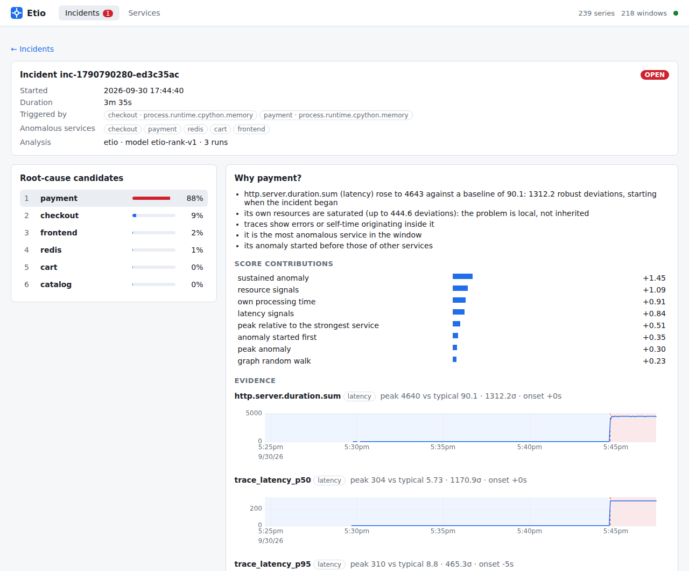

# Etio

Etio is a streaming root-cause analysis engine for systems instrumented with
OpenTelemetry. It ingests traces, metrics and logs over OTLP, detects
anomalies per signal, groups them into incidents, and ranks the services most
likely to have caused each incident, with the evidence behind the ranking.

Status: pre-release (0.1). Interfaces, configuration keys and on-disk formats
may change between minor versions until 1.0.



## Features

- **OTLP ingestion**: gRPC and HTTP (protobuf and JSON, gzip and zstd), with
  backpressure (`UNAVAILABLE` / `429` with `Retry-After`) when the engine
  falls behind.
- **Trace analysis**: trace assembly, clock-skew correction, per-service
  local (self) time, error origin attribution, and caller-side call edges,
  which also cover services that emit no telemetry themselves.
- **Detection**: per-series robust baselines, extreme-value thresholds
  (SPOT), robust CUSUM for gradual shifts, and conformal p-values for
  near-constant series.
- **Ranking**: a linear listwise model over 20 scale-free features, with
  exact per-feature contributions and rule-based explanations. BARO, N-Sigma,
  max-score and random-walk rankers are available for comparison.
- **Server**: REST API, server-sent events, web UI, Prometheus metrics,
  signed webhooks, snapshots and SQLite history, bearer-token authentication,
  TLS and mutual TLS.
- **Distributed mode**: edge nodes aggregate telemetry into mergeable window
  summaries and stream them to one or more core nodes, which run detection
  and analysis.
- **Tooling**: a simulator of microservice systems with fault injection, and
  a Python package that runs the same Rust code for offline evaluation.

## Getting started

### Requirements

- Rust 1.98 (selected automatically through `rust-toolchain.toml`)
- Node.js 24, to build the web UI (optional)
- Docker, for the container image and the examples (optional)

No system libraries are required: protobuf definitions are vendored,
SQLite is bundled and TLS uses rustls.

### Build and run

```sh
cargo build --release
cd ui && npm ci && npm run build && cd ..

ETIO__UI__DIR=ui/dist ./target/release/etio serve
```

The server listens on `0.0.0.0:4317` (OTLP/gRPC), `0.0.0.0:4318`
(OTLP/HTTP) and `0.0.0.0:7070` (API, UI and `/metrics`). Point an
OpenTelemetry SDK or Collector at the OTLP endpoints:

```yaml
# OpenTelemetry Collector
exporters:
  otlp/etio:
    endpoint: etio:4317
    tls:
      insecure: true
service:
  pipelines:
    traces:  { receivers: [otlp], processors: [batch], exporters: [otlp/etio] }
    metrics: { receivers: [otlp], processors: [batch], exporters: [otlp/etio] }
    logs:    { receivers: [otlp], processors: [batch], exporters: [otlp/etio] }
```

Detection starts after a warm-up period (about 25 minutes at the default
10 s resolution) during which baselines are learned.

### Container image

```sh
docker build -t etio .
docker run -p 4317:4317 -p 4318:4318 -p 7070:7070 -v etio-data:/var/lib/etio etio
```

The image is distroless, runs as a non-root user and includes a health check
(`etio health`).

### Examples

- [`examples/demo`](examples/demo): five small Python services instrumented
  with the OpenTelemetry SDK, Redis, an OpenTelemetry Collector and a load
  generator that injects a fault after the warm-up.
- [`examples/cluster`](examples/cluster): two edge nodes and a core node fed
  by the simulator.
- [`deploy/kubernetes`](deploy/kubernetes): manifests for a standalone
  deployment.

To try the engine without any instrumented system, run it against the
simulator. With `clock = "event"` the engine follows telemetry timestamps,
so the simulation can run faster than real time:

```sh
ETIO__CLOCK=event ETIO__ENGINE__RESOLUTION=5s ETIO__ENGINE__INCIDENT__WARMUP=8m \
  ./target/release/etio serve &
./target/release/etio sim run --fault cpu=6:cart@12m+5m --duration 22m --speed 30
curl -s http://127.0.0.1:7070/api/v1/incidents
```

## Configuration

Configuration is read from built-in defaults, an optional TOML file
(`--config`), and environment variables of the form `ETIO__SECTION__KEY`, in
that order. Unknown keys are rejected. Secrets (tokens, keys, webhook
secrets) are read from files referenced by the configuration.

```sh
etio config default     # print every setting with its default value
etio config check FILE  # validate a configuration file
```

See [docs/operations.md](docs/operations.md) for the main settings, sizing,
persistence, monitoring and the distributed mode.

## Evaluation

Root-cause ranking was evaluated on [RCAEval](https://github.com/phamquiluan/RCAEval)
(Pham et al., WWW 2025): 733 fault-injection cases (two defective cases
excluded) on Online Boutique, Sock Shop and Train Ticket. Given the telemetry
and the injection time, each method ranks the services. The metric is Avg@5,
the mean of top-1 to top-5 accuracy.

| Suite | Etio (default) | Etio (heuristic weights) | N-Sigma | BARO | BARO (reference code) |
|---|---|---|---|---|---|
| RE1 (373 cases, metrics) | 0.917 [0.895, 0.937] | 0.900 | 0.88 | 0.89 | 0.85 |
| RE2 (270 cases, metrics, logs, traces) | 0.945 [0.926, 0.964] | 0.917 | 0.89 | 0.75 | 0.76 |
| RE3 (90 cases, code-level faults) | 0.936 [0.909, 0.960] | 0.887 | 0.88 | 0.68 | 0.80 |

Notes:

- The default ranker contains weights learned on RCAEval. Its scores come
  from nested leave-one-system-out cross-validation: each system is scored
  by a model trained only on the other two. Intervals are 95 % bootstrap
  intervals.
- The heuristic column uses hand-set weights and no training data.
- N-Sigma and BARO are Etio's implementations run on the same inputs. They
  produce the same rankings as the reference implementations on cases
  without missing values; see the evaluation document for the difference on
  cases with missing values.
- These are offline results with a known incident time on three systems.
  They do not measure detection, and fault-injection benchmarks differ from
  production incidents.

The full methodology, per-dataset results, simulator results, negative
results and limitations are in [docs/evaluation.md](docs/evaluation.md).
Per-case results are in [`eval/results`](eval/results).

## Documentation

- [Architecture](docs/architecture.md)
- [Algorithms](docs/algorithms.md)
- [Evaluation](docs/evaluation.md)
- [Operations](docs/operations.md)
- [Security model](docs/security.md)
- [Architecture decision records](docs/adr/)

## Repository layout

| Path | Contents |
|---|---|
| `crates/etio-core` | Statistics, time, string interning |
| `crates/etio-analysis` | Detectors, service graph, ranking, explanations |
| `crates/etio-pipeline` | Trace analysis, log template mining |
| `crates/etio-engine` | Streaming engine, incidents, edge/core protocol |
| `crates/etio-otlp` | OTLP decoding |
| `crates/etio-server` | The `etio` binary |
| `crates/etio-sim` | Simulator |
| `crates/etio-py`, `python/` | Python bindings and evaluation harness |
| `ui/` | Web UI |
| `examples/`, `deploy/` | Docker Compose examples, Kubernetes manifests |
| `fuzz/` | Fuzz targets |

## Development

```sh
cargo fmt --all --check
cargo clippy --all-targets -- -D warnings
cargo test
cd python && uv run --group dev pytest      # Python harness
cd ui && npm test                           # web UI
```

See [CONTRIBUTING.md](CONTRIBUTING.md). Security issues should be reported
as described in [SECURITY.md](SECURITY.md).

## License

Licensed under the Apache License, Version 2.0. See [LICENSE](LICENSE) and
[NOTICE](NOTICE).
